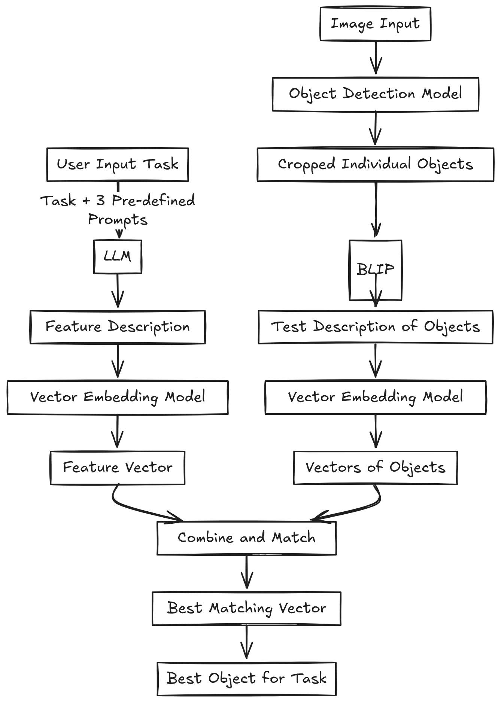

---

# 🧠 Semantic Matching for Task-Specific Object Detection 🚀

## **Overview**

This project is a **Semester 6 Mini Project** that combines cutting-edge techniques in **Natural Language Processing (NLP)** and **Computer Vision** to identify and select the best object for a user-defined task. It integrates models like **BLIP**, **LLM** (Large Language Models), and **Vector Embedding Models** to provide an end-to-end intelligent system.

---

## **How It Works** 🌟

### **Pipeline Diagram** 📊

The project consists of two main flows:

1. **Task Understanding**
   - Takes user input, processes the task using an LLM, and generates a **feature description vector**.
   
2. **Image Object Processing**
   - Processes an input image to detect and describe objects using:
     - **Object Detection Model** for cropping objects.
     - **BLIP (Bootstrapped Language-Image Pretraining)** for text descriptions.
     - Embedding models to transform object descriptions into vectors.
     
3. **Matching & Output**
   - Combines the task and object vectors to find the **best matching object** for the task.



---

## **Key Features** ✨

- **Multi-Modal Processing**: Combines text and image understanding.
- **LLM Integration**: Transforms user-defined tasks into actionable features.
- **BLIP for Vision-Language Tasks**: Extracts meaningful text descriptions of objects.
- **Vector Embedding Models**: Ensures precise semantic matching.
- **Efficient Object Matching**: Identifies the best-suited object for any given task.

---

## **Use Cases** 🌍

- **Robotics**: Task-specific object selection for automated systems.
- **Assistive Technology**: Helping visually impaired users identify objects for tasks.
- **Retail Search Engines**: Matching customer queries to products.
- **Content Analysis**: Semantic understanding of objects in images.

---

## **Tech Stack** 🛠️

- **Python**: Core programming language.
- **TensorFlow / PyTorch**: For deep learning models.
- **Sentence Transformers**: Embedding generation for task and object descriptions.
- **BLIP**: For image-to-text processing.
- **YOLO / Faster R-CNN**: For object detection (depending on your choice).
- **NumPy & Pandas**: Data processing and analysis.

---

## **Getting Started** 🚀

### **Installation**

1. Clone the repository:
   ```bash
   git clone https://github.com/username/project-name.git
   cd project-name
   ```

2. Install dependencies:
   ```bash
   pip install -r requirements.txt
   ```

3. Download the required pre-trained models:
   - **BLIP**: [Download here](https://github.com/salesforce/BLIP)
   - **Sentence Transformers**: Integrated via `sentence_transformers` package.

### **Folder Structure**

```plaintext
.
├── data/
│   ├── images/             # Input images
│   └── objects/            # Cropped objects from detection
├── models/
│   ├── object_detection/   # Object detection models
│   ├── BLIP/               # BLIP pre-trained weights
│   └── embeddings/         # Vector embedding models
├── src/
│   ├── preprocess.py       # Image preprocessing scripts
│   ├── task_vector.py      # Feature description vector generator
│   ├── match.py            # Combine and match vectors
│   └── utils.py            # Helper functions
└── README.md
```

---

### **Running the Project**

1. Add your image input file to the `data/images` folder.
2. Run the pipeline:
   ```bash
   python main.py --task "Pick up a cup" --image "data/images/sample.jpg"
   ```
3. View the best-matching object and its details in the console output.

---

## **Example Output** 🔥

**Input Task:**  
> _"Pick up a cup"_

**Detected Objects:**  
- Bottle  
- Cup  
- Pen  

**Best Match:**  
- **Cup** 🥤

---

## **Future Enhancements** 🚀

- **Real-Time Video Input**: Extend the project to work with live video feeds.
- **Interactive UI**: Create a web or desktop app for user interaction.
- **Domain-Specific Fine-Tuning**: Customize models for robotics or healthcare.

---

## **License** 📜

This project is licensed under the MIT License - see the [LICENSE](LICENSE) file for details.
